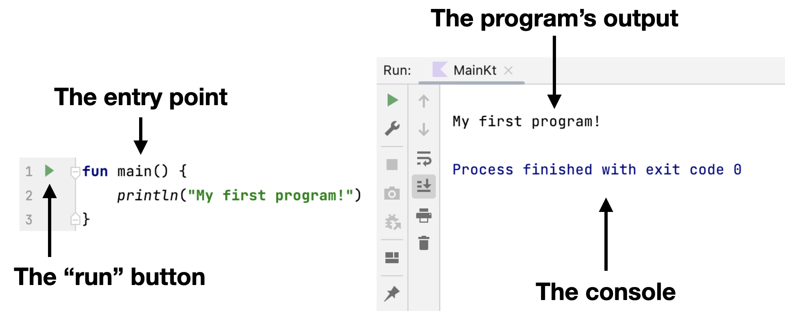

### Theory

Every program in any programming language has an **entry point**. 
As a rule, it is a special place in the program that controls everything 
that happens around.

In Kotlin, the [entry point](https://kotlinlang.org/docs/basic-syntax.html#program-entry-point) is the special `main` function, which looks like this:
```kotlin
fun main() {
    // Some code here
}
```

Everything that happens _inside_ the function (between the curly braces) 
will be executed while the program is running. 
This function can be placed in _any_ file in your project; 
you can even add _several_ `main` functions to one project. 
In the latter case, you can choose by yourself which entry point you want to run.

To `run` a program, you should click on the **green triangle** near the `main` function, 
and then the result of the program will be displayed in the _console_ inside the IDE:



___

### Task

**Description**: change the output text into `Hello!` and run the program.
